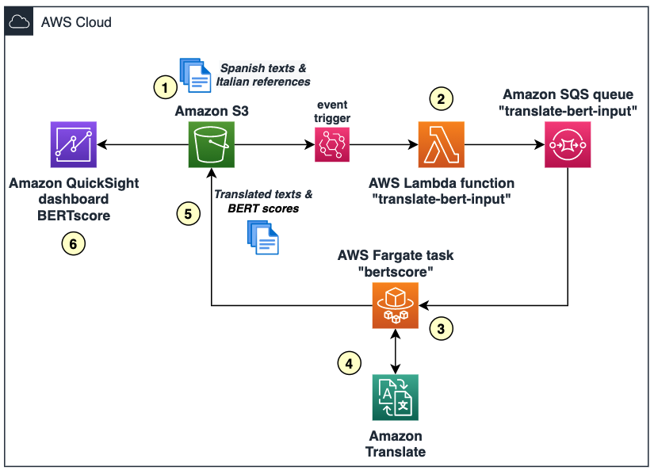

# Evaluating quality of Amazon Translate's translations with BERTscore

With this example, you will deploy the resources required in AWS for setting up an evaluator of translations from Spanish to Italian done by Amazon Translate, based on the open-source library BERT score (https://github.com/Tiiiger/bert_score).

## Architecture
The evaluator will follow this architecture in high-level:

where we have:
1. Text files uploaded to an Amazon S3 bucket, containing the original text (in Spanish) and the correct/reference translation to compare (in Italian). In example:
> Hola|Ciao
> Bienvenido a Italia, amigo|Benvenutto a la Italia, amico
> Hola chico|Ciao ragazzo
2. An AWS Lambda function gets automatically triggered for reading the rows in this file, and sending those as messages to an Amazon SQS queue
3. A container task in Fargate that will be constantly running (until manually stopped) for reading the SQS queue and processing the messages
4. Each message will be translated with Amazon Translate, and evaluated with BERT Score accordingly
5. The results of the processing are stored in another location of the Amazon S3 bucket as CSV files
6. Finally, an Amazon QuickSight dashboard is created for monitoring the BERTscore obtained for the sample texts

---

## Instructions

### Pre-requisites

### Deploying the AWS Cloud Formation template

### Fine tuning and testing the deployment

---
